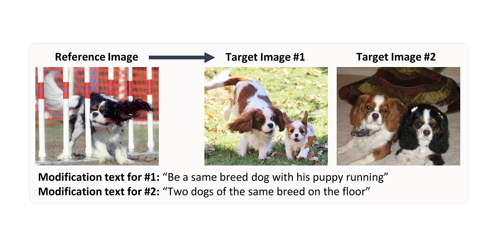

## Composed Image Retrieval on Real-life Images

We expand the task of composed image retrieval by introducing the **C**omposed **I**mage **R**etrieval on **R**eal-life images (**CIRR**) dataset - the first dataset of open-domain, real-life images with human-generated modification sentences.



Concurrently, we release the code and pre-trained models for our method **C**omposed **I**mage **R**etrieval using **P**retrained **LAN**guage **T**ransformers (**CIRPLANT**). Together with the dataset, we believe this work will inspire further research on this task on a finer-grain level.

Read more in our [published paper](#).

----
<sub>You are currently viewing the [Project homepage](https://cuberick-orion.github.io/CIRR/).</sub>


## CIRR Dataset

<!-- ### Download -->

Please visit our [repository](https://github.com/Cuberick-Orion/CIRR) to download the CIRR dataset. Details are in the README file.

<!-- ### Test-split Evaluation Server -->

We do not publish the ground-truth for the test-split of CIRR. Instead, an evaluation server is hosted at: [https://cirr.cecs.anu.edu.au/](https://cirr.cecs.anu.edu.au/), should you prefer to publish results on the test-split.

Note, the ground-truth for the validation-split is available as usual, and can be used for development.

## CIRPLANT Model

The model is hosted in this [separate repository](#). Please refer to the README file for details.

Our code is in [PyTorch](https://pytorch.org/), and is based on [PyTorch Lightning](https://www.pytorchlightning.ai/). 

To encourage continuing research in this task, we additionally provide an implementation of [TIRG](https://github.com/google/tirg) that is compatible with our code base.

## News
 - **Aug. 2021**: We are releasing our dataset and code for the project. Evaluation server coming soon!

## Licensing

 - We have licensed the code and annotations of CIRR under the MIT License. Please refer to the LICENSE file for details.

 - Following [NLVR2 Licensing](https://github.com/lil-lab/nlvr#licensing), we do not license the images used in CIRR, as we do not hold the copyright to them.

 - The images used in CIRR are sourced from the [NLVR2 dataset](https://lil.nlp.cornell.edu/nlvr/). Users shall be bounded by its Terms of Service.
 
## Citation

Please cite our paper if it helps your research:

```
# TODO
```

## Contact

If you have any question regarding our dataset, model or publication, please creat an issue in the [project repository](https://github.com/Cuberick-Orion/CIRR/issues), or email [zheyuan.liu@anu.edu.au](mailto:zheyuan.liu@anu.edu.au).